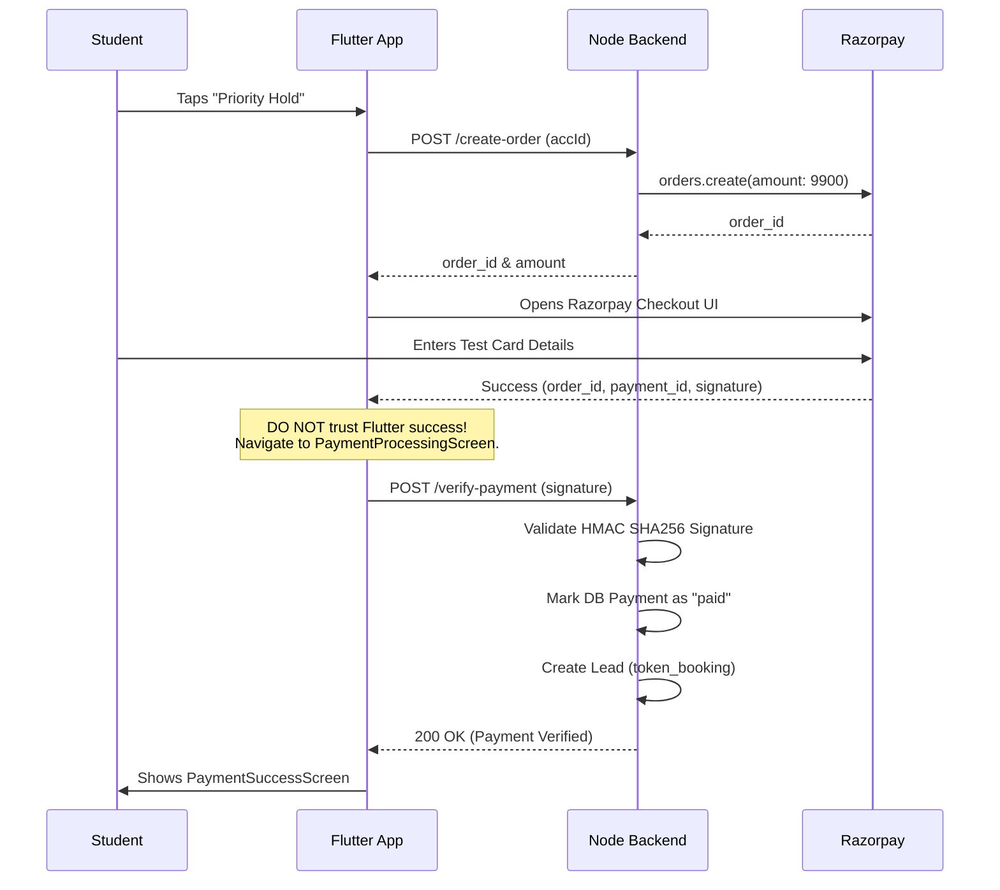

# Phase 4: Razorpay Payment Integration

## Overview

The "Priority Hold Request" module is fully implemented in the Flutter application. It allows students to securely pay a token amount (₹99) to elevate their lead status to `token_booking` / `pending_owner_approval`, prioritizing their request over standard visits.

---

## 1. Complete Payment Flow Diagram

---

## 2. Test Flow & Mocking

**How to test the Razorpay implementation locally:**

1. Navigate to the Accommodation Details screen.
2. Tap the amber **Priority Hold** button.
3. Tap **Pay & Hold**.
4. The Razorpay bottom sheet will slide up.
5. In development, use Razorpay's test cards:
   - **Card**: Any standard Visa test card (e.g., `4111 1111 1111 1111`)
   - **CVV**: `123`
   - **Expiry**: Any future date.
6. Submit the mock OTP (`122333`).
7. **Success Scenario**: The app routes to `PaymentProcessingScreen`, the backend verifies the mock signature, and routes to `PaymentSuccessScreen`.
8. **Error Scenario**: Close the Razorpay sheet manually. The app routes to `PaymentFailureScreen` with "Payment cancelled by user".

---

## 3. Security Implementation

- **Strict Server Authority**: The `Razorpay.EVENT_PAYMENT_SUCCESS` callback in Flutter *never* updates the local state to "paid". It only triggers an API call to `/verify-payment`.
- **HMAC Signature Checking**: The backend hashes `order_id + payment_id` with `RAZORPAY_KEY_SECRET`. If the flutter app is manipulated to send fake callbacks, the signature mismatch drops the request instantly.
- **Idempotency Check**: If the user double-taps or the Flutter app accidentally sends two `/verify-payment` requests, the backend checks `payment.status === 'paid'` and short-circuits safely, preventing duplicate Lead insertions.

---

## 4. MVP Completion & Next Steps

### Updated MVP Completion Percentage: **100%** 🎉

Phase 1 (Backend), Phase 2 (Next.js), Phase 3 (Flutter App), and Phase 4 (Payments) are fully completed according to the original approved blueprint.

### Remaining Work Before Production (Deployment Phase):

To take this platform live, the following DevOps and administrative tasks remain:
1. **Provision Production Databases**: Spin up a MongoDB Atlas production cluster.
2. **Environment Variables Injection**: Add `MSG91_AUTH_KEY`, real `RAZORPAY_KEY_ID`, `JWT_SECRET`, Cloudinary keys, and domain URLs into production `.env`.
3. **Backend Deployment**: Push the Node.js server to Render, Railway, or AWS.
4. **Website Deployment**: Push the Next.js app to Vercel.
5. **App Stores**: Generate Android `.aab` and iOS `.ipa` builds and publish to Play Store and App Store.
